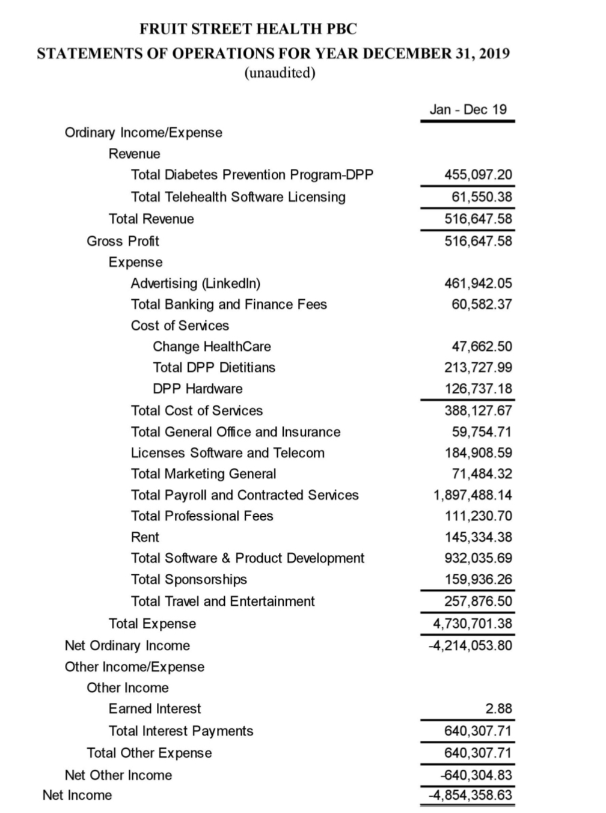
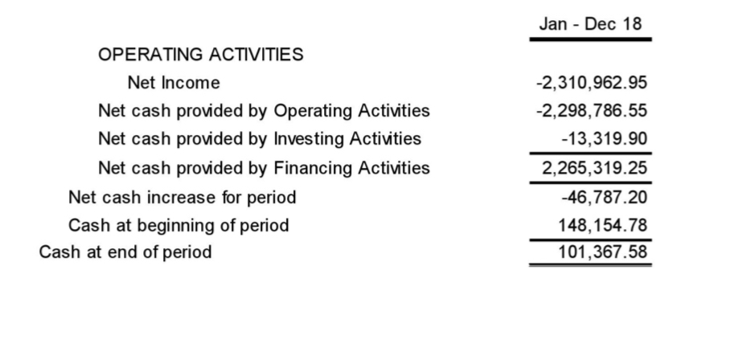

= Invest in Fruit Street Health

If you found this page, you might be interested in Fruit Street Health and its founder, Laurence N. Girard.
Fruit Street Health is a telemedicine company that has operated since May 6, 2014 and purports to help users lose weight to manage prediabetes.
Founder Laurence Girard has experience through multiple tech startups and a soccer team, New Amsterdam FC.
This website illuminates the unique opportunities available to a discerning investor around both Fruit Street Health, including a look at public financial statements.

== Fruit Street Health

Fruit Street has had several funding rounds since 2014, which are documented on https://www.crunchbase.com/organization/fruit-street-health[Crunchbase].
Of particular interest to is a round filed in 2020 during the COVID-19 pandemic because of the amounts listed in this https://www.sec.gov/Archives/edgar/data/1609428/000166516020000695/offeringmemoformc.pdf[SEC document].
Information including expenses and revenues are available for the years 2019 and 2018.

Note that all expenses, including interest payments, total out to nearly 10x the year's revenue.
This is five years after the company's founding when there has been time to establish a completed product, cement its foothold in the marketplace, and develop a sustainable mode of operation. 
The diabetes prevention program's revenues are below $500K. 
At a rate of $500 per customer, this totals below 1000 users of the platform per year, despite the many doctors who have invested in it and might be presumed to encourage patients to try the platform for themselves.

Equally of interest are the expenses.
Despite being a telemedicine company which might focus on empowering remote work, travel and expenses are $250K- half of total revenues.
Adding in the cost of the hardware and dietiticans for the main product- the diabetes prevention plan- means these expense categories are already larger than the entire revenue of the company.
This is aside from the cost of payroll, product development, software licensing, and even office rent, which further increase the issue.

For additional evidence of the number of users of the Fruit Street platform, visit the https://play.google.com/store/apps/details?id=com.fruitstreet.dpp&hl=en_US&gl=US[Android Play Store listing] for the app.
At the bottom, the number of Installs is listed- "100+" as of 2022.
Compare this number with the listed revenue from 2019 and the current price of enrolling in the Fruit Street diabetes program.
Remember, this is over 7 years after the company's founding, and is the total number of installs across the app's lifetime on Android.

Now that we've looked at the figures, let's take a look at the valuation.
Remember, the valuation set by the company will affect how much of the company your investment is worth.

image::valuation.png[]

In particular, note the line "The company set its valuation internally without a formal third-party independent valuation."
Any valuation figure stated at face value should be evaluated against the company's own financials, business plan, and track record.
Note that unlike many tech companies, Fruit Street's business is not one where hypergrowth can occur without matching expense.
A growth in the number of Fruit Street users necessitates the sending of more hardware, the retention of more time from dieticians, and other costs that scale with use.

Note also that the valuation of the company has grown from $60M to $100M per this document.
Ask in what ways the company grew to justify a 60% increase in value despite continued expense and low subscriber count.
Ask: if you invest, will the self-valuation increase further, and will it be justified?

You may be wondering at this stage how the company continues to operate.
Quite simply put: Fruit Street primarily runs on continued investment money.
Refer back to the expenses statement and look at how much money is being poured into LinkedIn recruiting.
Now look at this statement of how much cash is provided by "financing activities".
The amount raised happens to be almost identical to how much was spent on "operating activities".

== Previous Tech Startups

As the majority of the company is owned by, and answers solely to, Laurence Girard, it is worth examining his previous business experience and behavior.
Laurence had several previous companies including Prevently and Welliko.
These ultimately failed, however Laurence issued shares in later companies (including Fruit Street) to a number of his prior investors to smooth over any issues from this.
However, several of his investors stood up a website to tell the story of what happened to them and others at these companies.
While it is no longer available at its original location, http://web.archive.org/web/20150328070220/http://www.laurencengirard.com/[The Internet Archive has a backup copy here], which includes many valuable insights for future investors.

If you would prefer a few highlights from the page before spending the time to read all of it, here are some samples of internal emails that were sent by Laurence. The first email dates from April 5, 2014, one month before the founding of Fruit Street Health:

[Laurence Girard email from April 5, 2014, one month before the founding of Fruit Street Health]
----
Dear Jim Fulton,
You are the most incompetent lawyer I have ever met in my life and probably will ever meet in my life. I hope that Joe Conroy fires you because of what a miserable job you did on Prevently and how incompetent you are.
Mark my words – The sole responsibility of Prevently’s failure (if it fails) will be Jim Fulton’s. 
I’m sure he will fire you after I sue you for malpractice you piece of shit. I’m sure I can get the shareholders on board with suing you for malpractice too because they think that the way you structured Kristen’s stock purchase agreement is beyond incompetent. Some described it as “fucking stupid” and others described it as “ridiculous” while others described it as “the dumbest fucking contract created in the history of mankind.” Yes you are an idiot.
----

Another email from May 3, days before the official founding of Fruit Street Health:

----
Oh yea and Jim first of all despite the fact that those numbers are mischaracterized, even if they were true it would still be 100% legal.

The executives of real startup or companies quite often get paid way over $100K EACH per year.

Clearly you just want me to be your little bitch and work for free like a jew in egypt or an African American in the south in the 1800s. Sorry not gonna happen buddy.

I am not your little slave that works for free.

I raised your ass a million bucks, built software worth millions of dollars, and doubled the value of your shares.

I increased shareholder value 6.2 fold in two months until the directors fucked it up and the value of the shares dropped to zero.
----

On April 17th, the following threat was made in an email:

----
With lawsuits taking place within this company, it will not be able to raise funds and it will end. Mark my words – I will not let the shareholders down and I will take all actions in their interest against you. You need to do the same and resign immediately else you run the risk of facing significant personal liability in a lawsuit and being deported from this country since you are NOT a U.S. Citizen. 
----

There are many other emails and much other information from previous investors at the site.
All of it is worth reading before investing your money.

You may also be interested in Laurence's side of the story from this time. 
You may find this at an archived version of a rebuttal website that he wrote https://web.archive.org/web/20140814000629/http://www.thereallaurencengirard.com/the-history-of-prevently/laurence-n-girard/[available here].
The background color of the website makes this rebuttal difficult to read; viewers may find it helpful to use a reader mode or extension available in many browsers.

== Soccer Investments

Within the last few years, Laurence Girard has created and operated the soccer team New Amsterdam FC, while his wife Lindsey Sacks (who is also a Fruit Street executive) has purchased and operated the soccer team Chicago House AC.
While there is not as much information available on Chicago House, there is much public documentation available around the connections between Fruit Street Health and New Amsterdam FC.

This https://fundify.com/fast-pitch/new-amsterdam-football-club/85cb5576/pitch[Fundify] listing for New Amsterdam includes much interesting information on detailed financials and its relation to Fruit Street.
When reading, bear in mind that Laurence Girard owns the majority of both Fruit Street Health and New Amsterdam Football Club and directs both companies.

image::nafc-capitalization.png[]

One note from the Fundify link is that it appears to list Michael Hitchcock as CEO.
However, this text appears to be from a listing for PMI, where he is CEO.
According to Laurence's bio with his other soccer team, https://www.chicagohouseac.com/laurence-girard[Chicago House AC], Laurence is the CEO of New Amsterdam FC, and pays himself a salary from that team as well as his salary from Fruit Street.

Funding for New Amsterdam FC seems to largely come from Fruit Street.
https://www.wfmz.com/news/pr_newswire/pr_newswire_sports/new-amsterdam-fc-announces-fruit-street-health-as-spring-2021-nisa-shirt-sponsor/article_0f952d69-d230-5e36-a00b-1ad82144fcd1.html[Fruit Street provided both shirt sponsorships and an ownership stake in New Amsterdam FC] according to this press release.
This balance sheet from Fundify notes that much of New Amsterdam is funded by a combination of equity and loans, and the Fundify site also states that New Amsterdam is reliant on Fruit Street's money to survive:

image::nafc-equity.png[]
image::nafc-reliance.png[]

Be aware that if you do believe in Fruit Street's mission, a significant amount of your investment may be used to run the New Amsterdam FC soccer team.

== Curent New Amsterdam FC issues

Since investing in Fruit Street necessarily implies an investment in New Amsterdam, you may be interested in how the CEO of both companies has handled the latter.
After raising a fundraising round in October of 2021, New Amsterdam has ceased to play in its league, the National Independent Soccer Association (NISA) in 2022.
If you would like to read the full story as told by CEO Laurence Girard, please view this link:nafc-tweets.html[tweet archive] of a number of since-deleted statements released by the account @nafcnyc on Twitter.
Readers are advised of strong language contained within. 
